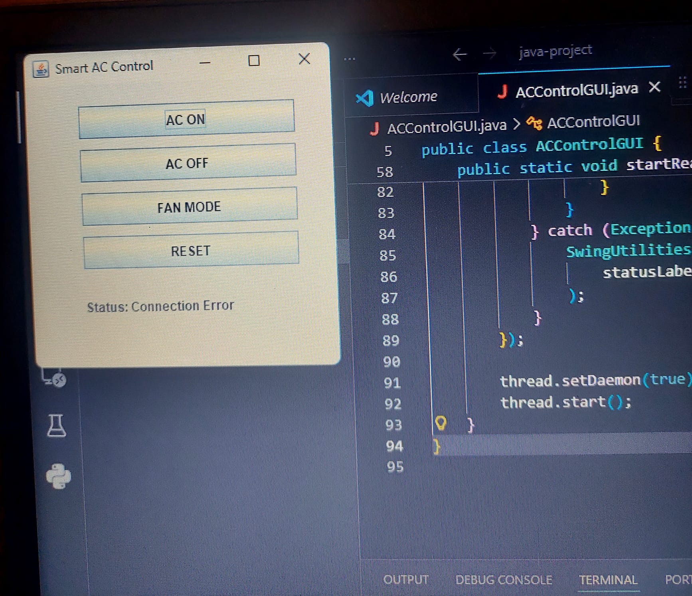

# Smart AC Control System

## 📌 Project Overview
This project is a Java Swing + Arduino based system that simulates a smart air conditioner control system.

The Java desktop application communicates with Arduino via USB Serial (COM port) and allows users to control the AC system.

The system provides a clear visual feedback using an LED:
- AC ON → LED turns ON
- AC OFF → LED turns OFF
- Fan Mode → LED blinks

Arduino sends status messages back to the GUI, and the GUI displays these messages in real-time.

---

## 🎯 Purpose
The purpose of this project is to demonstrate communication between software (Java GUI) and hardware (Arduino) through a real-life scenario.

It allows:
- Remote control of AC states (ON/OFF/FAN/RESET)
- Real-time feedback from hardware to GUI
- Simulation of a smart home device

---

## ⚙️ Technologies Used
- Java (Swing GUI)
- Arduino (C/C++)
- Serial Communication (USB / COM Port)

---

## 🔌 Hardware Components
- Arduino Uno  
- LED  
- Resistor (220Ω)  
- USB Cable  

---

## 🧠 System Functionality

### GUI Features
- Connects to Arduino via COM port  
- AC ON button  
- AC OFF button  
- FAN MODE button  
- RESET button  
- Displays real-time status messages  

### Arduino Features
- Receives commands from Java  
- Controls LED accordingly  
- Sends status messages back to Java  

---

## 🔄 Communication Protocol

### Commands (Java → Arduino)
| Command | Meaning |
|--------|--------|
| 1 | AC ON |
| 2 | AC OFF |
| 3 | FAN MODE |
| 4 | RESET |

### Responses (Arduino → Java)
- "AC ON"  
- "AC OFF"  
- "FAN MODE"  
- "RESET"  

### Example Communication
- Java → Arduino: "1" → Arduino → Java: "AC ON"  
- Java → Arduino: "3" → Arduino → Java: "FAN MODE"  

---

## ▶️ How to Run

### 1. Arduino Setup
1. Open Arduino IDE  
2. Open the `.ino` file  
3. Select Arduino Uno  
4. Select correct COM port  
5. Upload the code  

### 2. Java Application
1. Open project in IDE (IntelliJ / Eclipse)  
2. Run the Java GUI file  
3. Select correct COM port  
4. Use the buttons  

---

## 🖥️ GUI Screenshot


---

## ✅ Requirements Checklist
✔ GUI sends commands to Arduino  
✔ Arduino responds with status messages  
✔ Visible effect (LED ON/OFF / blinking)  
✔ At least two GUI controls (buttons)  
✔ GUI displays incoming data  
✔ Communication protocol documented  
✔ GitHub repository includes README + code  

---

## 🚀 Conclusion
This project successfully demonstrates a smart AC control system using Java and Arduino.

Users can control the AC states (ON, OFF, FAN, RESET) through a graphical interface, while the LED provides a clear visual representation of the system status. The system also supports real-time feedback from Arduino, making it a complete and interactive hardware-software integration project.

---

## 📁 Project Structure
```
.
├── ACControlGUI.java
├── ac_control.arduino.ino
├── gui.png.jpeg
└── README.md
```


